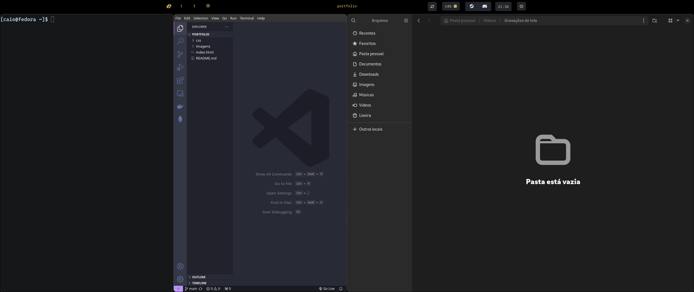

# Repositório de armazenamento de arquivos de configuração do ambiente Linux Fedora, com hyprland e waybar.

## Demonstração da configuração waybar

## Demonstração da configuração do hyprland

## Detalhes
Este repositório não tem script de instalação, ao baixa-lo, é necessário fazer a substituição manual dos arquivos, os arquivos foram idealizados para funcionarem em um ambiente Linux Fedora 40.
